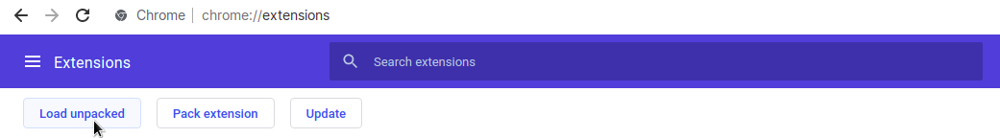
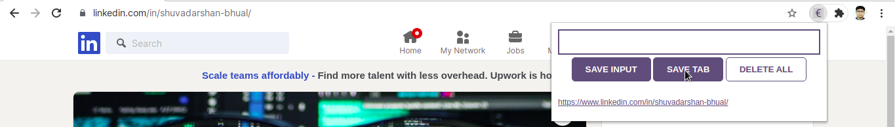

  <h3 align="center">The Essential Lead Tracker</h3>

  <p align="center">
    The only one that you will ever need, to keep an organized list of potential leads for your product!
    <br />
  </p>
</p>


<!-- TABLE OF CONTENTS -->
<details open="open">
  <summary>Table of Contents</summary>
  <ol>
    <li>
      <a href="#about-the-project">About The Project</a>
      <ul>
        <li><a href="#built-with">Built With</a></li>
      </ul>
    </li>
    <li>
      <a href="#getting-started">Getting Started</a>
      <ul>
        <li><a href="#installation">Installation</a></li>
        <li><a href="#adding-it-to-your-chrome-browser-as-an-extension">Adding it to your Chrome browser as an extension</a></li>
      </ul>
    </li>
    <li><a href="#usage">Usage</a></li>
    <li><a href="#license">License</a></li>
    <li><a href="#contact">Contact</a></li>
    <li><a href="#acknowledgements">Acknowledgements</a></li>
  </ol>
</details>


<!-- ABOUT THE PROJECT -->
## About The Project


It can indeed be challenging sometimes for marketers and sales representatives to keep an organized track of potential leads for their products. After all, getting a lead to develop trust in the company's brand and make up his/ her mind to make a purchase, does require a lot more than just keeping track of them.<br/>

This is where the Essential Lead Tracker comes to the rescue!<br/>

As the name suggests, the tracker helps sales representatives and marketers in maintaining an organized list of potential leads, which in my opinion, is quite an essential step in the sales and marketing process. This not only helps them to have a better overview of who their potential leads might be, but also allows them to devote more time to the other activities in the sales and marketing of their product, thus ensuring a better sales campaign and hence, higher chances of potential purchases.<br/>

### Built With

These are the technologies that I used to build the Essential Lead Tracker:
* HTML5
* CSS3
* JavaScript


<!-- GETTING STARTED -->
## Getting Started

To get a local copy of the app, up and running on your system, follow these steps.


### Installation

1. Fork this repository
<div style="text-align:center"></div>

2. Clone the repository
   ```sh
   git clone https://github.com/theRangeCoder/lead-tracker-chrome-extension.git
   ```

### Adding it to your Chrome browser as an extension

To add the extension to your Chrome Browser, follow the steps below.

1. Go to `chrome://extensions/` on your Chrome Browser.

2. Click on the `Load unpacked` button.

<div style="text-align:center"></div>

3. Select the `lead-tracker-chrome-extension` directory and click `Open`.

There you go! The Lead Tracker has been successfully added to your Chrome Browser as an extension.<br/>

Happy Tracking!

<!-- USAGE EXAMPLES -->
## Usage

Once you have successfully added the extension to your Chrome Browser, you can start utilizing it to the fullest.<br/>

Have a lead in mind, that you would like to save manually? The `SAVE INPUT` button can be pretty handy in here.<br/>

<div style="text-align:center"></div><br/>

To save leads from particular websites, the `SAVE TAB` button could be a good option.<br/>

<div style="text-align:center"></div><br/>

And finally, once you have completed the interactions with the current leads and would like to remove them from the list (in order to be able to create a new list of leads), the `DELETE ALL` button can be pretty useful for that.


<!-- LICENSE -->
## License

The README template, used for this project, was distributed under the MIT License. See `LICENSE` for more information.


<!-- CONTACT -->
## Contact

#### Shuvadarshan Bhual
* Drop me an [email](mailto:sbhual1998@gmail.com) 
* Follow me on [Twitter](https://twitter.com/theRangeCoder)
* Let us connect on [LinkedIn](https://www.linkedin.com/in/shuvadarshan-bhual)


<!-- ACKNOWLEDGEMENTS -->
## Acknowledgements
* The code was adapted from [Per Harald Borgen's JavaScript course](https://scrimba.com/learn/learnjavascript)
* [Othneil Drew](https://www.othneildrew.com) for the [README template](https://github.com/othneildrew/Best-README-Template)
* <a target="_blank" href="https://icons8.com/icon/89862/euro">Tracker icon</a> by <a target="_blank" href="https://icons8.com">Icons8</a>

